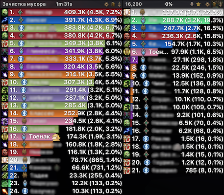

# Details!|Skada Covenants

Plugin for **Details!** and **Skada**, that show covenant icon near player name. [CurseForge page](https://www.curseforge.com/wow/addons/details-covenants)

### How it works:

Blizzard don't allow to inspect in which covenant is other players. Only yours own covenant is available in API. So addon track spells casted by your teammates and detect covenant by this spells (both main covenant ability and minor). Thats why covenant icons appears after only few fights.

In version `1.0.0` players with this addon share they covenant by addon messaging. So covenants will be detected immidiatly for players with this addon.

**Important for Details!**: Its based on nickname feature of Details. You shouldn't disable nicknames, for correct work.

### Commands:

You can call help in game `/dc` or `/dcovenants`. And also subcommands: 

 - `icon [number]` change size of icons
 - `chat [on | off]` log a new character's covenant to chat
 - `log [all | group]` prints all collected data or just for your party/raid
 - `align [left | right]` change align of covenant icon

### Developers:

In version `1.0.0` you can access all collected data with `_G.Oribos:getCovenantIconForPlayer(<playerName>)`
